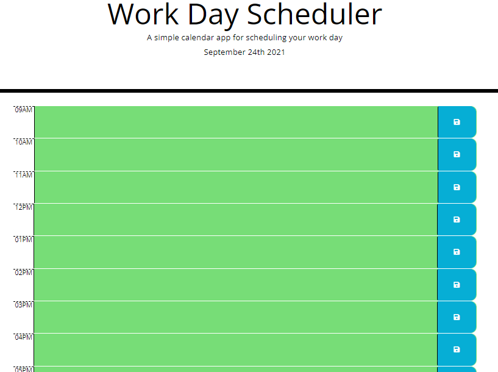

Name: Nikhil Kharbanda  
Project: Work Day Scheduler  
URL to project: https://nikhil-kharbanda.github.io/UofT_WorkDayScheduler/  
Due: September 24th, 2021  

In this assignment, we were tasked to make a simple scheduler that displays the work hours, and allows the user to enter a description or a calender reminder.  

Checklist:  
[X] Current day is displayed at the top of the   
[X] Presented with timeblocks for standard business hours  
[X] Each timeblock is color coded to indicate whether it is in the past, present, or future  
[X] Can enter and save an event to local stoage  

